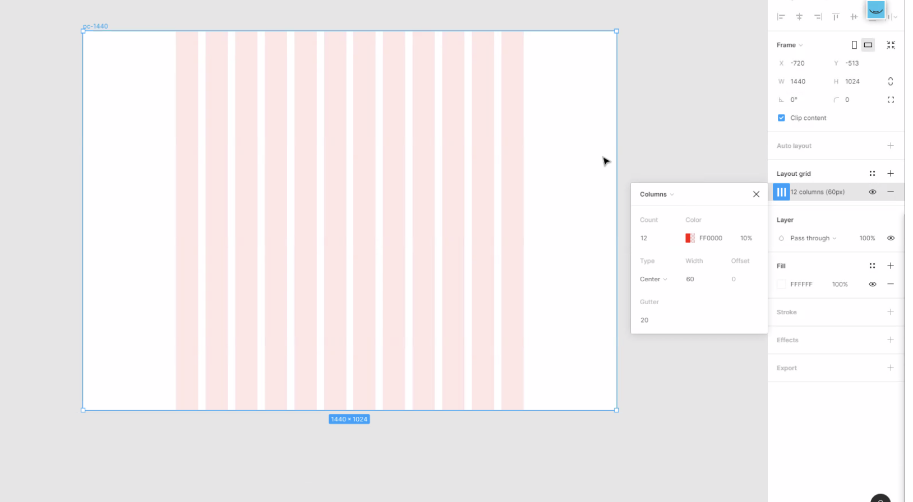
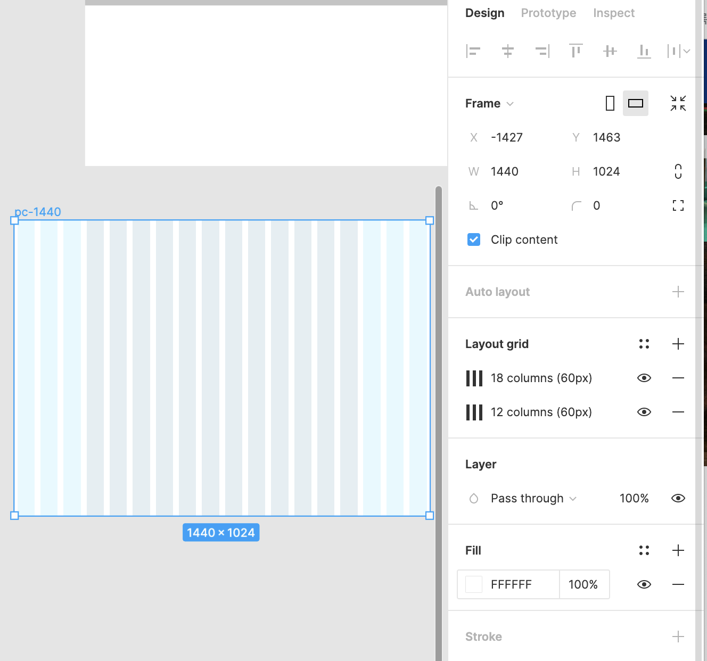
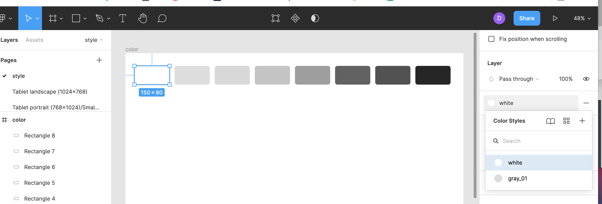

# Figma 단축키 및 중요한 기능
(cf. 맥유저 기준, 윈도우는 cmd를 ctrl로, alt를 option으로 대체!)
-  자주 사용할 만한 기능 → 카테고리별 정리

 

[**Text**] 

| 단축키 | 설명           |
| ------ | -------------- |
| T      | text 박스 생성 |
| Cmd+B | 볼드 Bold      |
| Cmd+I | 이탤릭 Italic  |
| Cmd+U | 밑줄 Underline |

 

[**Edit**] 

| 단축키         | 설명                                           |
| -------------- | ---------------------------------------------- |
| Cmd+C         | 복사 Copy                                      |
| Cmd+X         | 잘라내기 Cut                                   |
| Cmd+V         | 붙여넣기 Paste                                 |
| Cmd+Shift+V   | 선택 위에 붙여넣기 / Paste Over Selection|
| Option+drag       | 선택 복사 Duplicate Selection                  |
| **Cmd+Optiont+C** | **속성 복사 Copy Properties**                  |
| **Cmd+Optiont+V** | **속성 붙여넣기 Paste Properties**             |

 

[**File & Properties**] 

| 단축키       | 설명                                    |
| ------------ | --------------------------------------- |
| Cmd+Shift+E | 출력(/로컬컴퓨터에 저장) →Export        |
| Cmd+Option+S   | 히스토리 저장 → Save to Version History |
| Cmd+Shift+K | 이미지 삽입하기|

 

[**Select**] 

| 단축키           | 설명                             |
| ---------------- | -------------------------------- |
| Cmd+right-click | 레이어 선택  / Select Layer Menu |
| Cmd+click       | 직접 선택 / Deep Select          |

 

[**View**] 

| 단축키                                | 설명                           |
| ------------------------------------- | ------------------------------ |
| ⎵(스페이스바)+drag                    | 드래그하면서 화면 이동         |
| Cmd+ `+`/`-`     | 줌인 Zoom In                   |
| Shift+1                               | 화면에 맞추기 Zoom to Fit      |
| Shift+0                               | 100%로 맞추기 Zoom to 100%     |
| Shift+R                               | 눈금자 Rulers                  |
| Cmd+Shift+3                          | 외곽선으로 보기 Show Outlines  |
| Cmd+Option+Y                            | 픽셀 모드 프리뷰 Pixel Preview |

 

[**Arrange**] 

| 단축키       | 설명                                 |
| ------------ | ------------------------------------ |
| Shift+A      | 오토레이아웃 만들기 / Add Auto Layout  |
| Option+Shift+A  | 오토레이아웃 해제 / Remove Auto Layout |
| Cmd+]       | 앞으로 가져오기 / Bring Forward        |
| Cmd+[       | 뒤로 보내기 / Send Backward            |
| Cmd+Shift+] | 맨 앞으로 가져오기 / Bring to Front    |
| Cmd+Shift+[ | 맨 뒤로 보내기 / Send to Back          |

 

[**Tools**] 

| 단축키  | 설명                                    |
| ------- | --------------------------------------- |
| V       | 이동하기 / Move                               |
| C       | 코멘트 추가 또는 보기 / Add, Show Comments |
| P       | 펜                              |
| Shift+P | 연필                     |
| R       | 사각형 그리기                 |
| O       | 원 그리기               |
| L       | 선 그리기                        |
| F       | 프레임 생성                 |
| S       | 슬라이스                 |
| I       | 스포이드 툴 / Color Picker                   |

 

[**Object**] 

| 단축키               | 설명                                 |
| -------------------- | ------------------------------------ |
| Cmd+G               | 그룹 / Group Selection                 |
| Cmd+Shift+G         | 그룹 해제 / Ungroup Selection          |
| Cmd+Shift+H         | 숨기기/나타내기 / Show, Hide Selection  |
| Cmd+Shift+L         | 잠금, 잠금해제 / Lock, Unlock Selection  |
| **Cmd+Option+Shift+L** | **전체 잠금 해제 Unlock All Object** |
| Cmd+E               | 병합 Flatten Selection               |
| Cmd+Shift+O         | 윤곽선(Outline)으로 변경 |

 

[**Components**] 

| 단축키     | 설명                             |
| ---------- | -------------------------------- |
| Cmd+Option+K | (선택한 요소) 컴포넌트 만들기 |

 

[**Etc.**] 

| 단축키 | 설명 |
| ------ | ---- |
| Cmd+/  | 검색창 열기 |

 

## 주요 기능 및 알아두면 좋은 것
- 피그마에서 grouping 하고 싶을 때 `gourp`속성을 사용해도 되지만, `frame`이라는 속성을 사용해서 그루핑을 하면 특히 반응형웹 프로토타입을 만들 때 유용하다.    
(cf. 애매하다 싶으면 frame 의 사용이 권장되고 있다!)
- 그루핑 할때 사용할 수 있는 또 다른 유용한 기능: 
  - [Auto Layout](https://dev-bak.tistory.com/m/11) 
- 컴포넌트를 만들고나서, 해당 컴포넌트를 복사해서 다른곳들에 붙여넣으면 원본 컴포넌트는 parent component가 되고, 복사해서 다른 곳에 붙여진 아이들은 child components들이 된다.     
그래서 원본/부모 컴포넌트에 변화를 주면, 그 밑에 자식 컴포넌트들은 자동으로 스타일이 바뀐다. 
- 그리드 효과를 주고싶으면 `Layout Grid`기능 사용하기!       

 

 

- 자주사용하는 컬러, 폰트 등은 변수처럼 선언해서 전부 library에 등록하고 이를 값처럼 사용할 수 있다. 
 

 
 

---

CLICK ME!
  

- cf.  
  - https://nicecarrot2.tistory.com/93
  - https://dev-bak.tistory.com/m/11
  - http://designbase.co.kr/sketch-4/
  - https://www.youtube.com/watch?v=WC9FhdOltA4
  - https://960.gs/    
  - https://365kim.tistory.com/40

</detials>

---